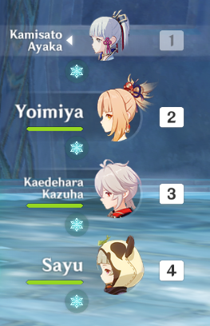

# Cleanser

Characters that can cleanse, sometimes called cleansers, refer to characters that have the ability to inflict themselves or other members of their team with an elemental status. 

This can sometimes be used to remove unwanted debuffs on your own characters that can occur when attempting some of Genshin Impact's more challenging content such as Domains and Spiral Abyss, typically due to a Ley Line Disorder that periodically affects the entire Domain or Floor.

Debuffs that can affect your characters are listed in the Abyss helper guide [here](https://genshinhelper.gitbook.io/abyss/mechanics/debuffs).

## How it works

A Ley Line disorder can be specified on entry to a Domain or Floor in Spiral Abyss. For example, the Ley Line Disorder given by the Forsaken Rift Domain \(Domain of Mastery: Frosted Altar IV\) reads:

Here is an example of the Ley Line Disorder in action, afflicting our characters with Cryo and increasing our stamina consumption. No Cryo damage is taken when the status is inflicted. 

This debuff inflicts all your characters with Cryo and is displayed both above the health bar as in the image above as well as on the character listing on the right of the screen as shown below.

Using particular character's Elemental Skills or Elemental Bursts can inflict characters with another elemental which can then react with the Ley Line Disorder element that is already affecting the character, causing an Elemental Reaction to occur but also removing the debuff from the Ley Line Disorder.


Some Elemental Reactions, while removing the debuff, may be detrimental to your party. For example, Barbara's Elemental Skill in the example above would inflict Hydro on the active character, removing the debuff but also causing the character to become Frozen.


## Characters that can Cleanse

<table>
  <thead>
    <tr>
      <th style="text-align:center"></th>
      <th style="text-align:left"></th>
    </tr>
  </thead>
  <tbody>
    <tr>
      <td style="text-align:center">
        

          
        

        
Barbara

      </td>
      <td style="text-align:left">
        <ul>
          <li>Elemental Skill periodically inflicts Hydro on the active character.</li>
        </ul>
      </td>
    </tr>
    <tr>
      <td style="text-align:center">
        

          
        

        
Beidou

      </td>
      <td style="text-align:left">
        <ul>
          <li>Can only cleanse herself as using her Elemental Skill causes Beidou to
            be affected by Electro.</li>
        </ul>
      </td>
    </tr>
    <tr>
      <td style="text-align:center">
        

          
        

        
Bennett

      </td>
      <td style="text-align:left">
        <ul>
          <li>The field generated by their Elemental Burst constantly inflicts Pyro
            on the active character.</li>
        </ul>
      </td>
    </tr>
    <tr>
      <td style="text-align:center">
        

          
        

        
Diona

      </td>
      <td style="text-align:left">
        <ul>
          <li>Diona&apos;s shield inflicts Cryo on the active character when the character
            is swapped to.</li>
        </ul>
      </td>
    </tr>
    <tr>
      <td style="text-align:center">
        

          
        

        
Jean

      </td>
      <td style="text-align:left">
        <ul>
          <li>The field generated by their Elemental Burst constantly inflicts Anemo
            on the active character.</li>
        </ul>
      </td>
    </tr>
    <tr>
      <td style="text-align:center">
        

          
        

        
Xingqiu

      </td>
      <td style="text-align:left">
        <ul>
          <li>Can only cleanse himself as using his Elemental Skill causes Xingqiu to
            be affected by Hydro.</li>
        </ul>
      </td>
    </tr>
    <tr>
      <td style="text-align:center">
        

          
        

        
Xinyan

      </td>
      <td style="text-align:left">
        

        <ul>
          <li>Xingyan&apos;s shield inflicts Pyro on the active character when the character
            is swapped to.</li>
        </ul>
      </td>
    </tr>
  </tbody>
</table>

