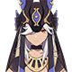

# Quicken (Aggravate)

On-Field DPS**Quicken (Aggravate)** teams focus on frequently applying **Electro** to **Quickened** targets **** to trigger the **Aggravate** reaction. Despite having a lower **DMG** multiplier than **Spread**, **Electro**-based **Aggravate** teams can cause the reaction more consistently, which can lead to better damage output.


**Characters are ranked roughly according to how well they perform in this team composition.**


## Characters



|                                    On-Field DPS                                    |                                          Dendro Core Support                                         |                         Electro Flex Support/Off-Field DPS                         |                                       Debuffer                                       |
| :--------------------------------------------------------------------------------: | :--------------------------------------------------------------------------------------------------: | :--------------------------------------------------------------------------------: | :----------------------------------------------------------------------------------: |
| 

Keqing
 |          

Nahida
          | 

Fischl
 |  

Kazuha
  |
|                                                                                    |          

Collei
          |          Shinobu          | 

Sucrose
 |
|                                                                                    | 

Dendro Traveler
 | 

Beidou
 | 

Zhongli
 |
|                                                                                    |          

Yaoyao
          |                                                                                    |   

Venti
   |
|                                                                                    |                                                                                                      |                                                                                    |    

Sayu
    |
|                                                                                    |                                                                                                      |                                                                                    |      
 Jean
     |



|                                  On-Field DPS                                  |                                          Dendro Core Support                                         |                             Electro Flex Support/Off-Field DPS                            |                                       Debuffer                                       |
| :----------------------------------------------------------------------------: | :--------------------------------------------------------------------------------------------------: | :---------------------------------------------------------------------------------------: | :----------------------------------------------------------------------------------: |
| 

Cyno
 |          

Nahida
          |     

Fischl
    |  

Kazuha
  |
|                                                                                |          

Collei
          | 

Shinobu
 | 

Sucrose
 |
|                                                                                | 

Dendro Traveler
 |     

Beidou
    | 

Zhongli
 |
|                                                                                |          

Yaoyao
          |                                                                                           |   

Venti
   |
|                                                                                |                                                                                                      |                                                                                           |    

Sayu
    |
|                                                                                |                                                                                                      |                                                                                           |      
 Jean
     |



|                                    On-Field DPS                                    |                                          Dendro Core Support                                         |                         Electro Flex Support/Off-Field DPS                         |                                       Debuffer                                       |
| :--------------------------------------------------------------------------------: | :--------------------------------------------------------------------------------------------------: | :--------------------------------------------------------------------------------: | :----------------------------------------------------------------------------------: |
| 

Beidou
 |          

Nahida
          | 

Fischl
 | 

Sucrose
 |
|                                                                                    |          

Collei
          |                                                                                    |  

Kazuha
  |
|                                                                                    | 

Dendro Traveler
 |                                                                                    | 

Zhongli
 |
|                                                                                    |          

Yaoyao
          |                                                                                    |   

Venti
   |
|                                                                                    |                                                                                                      |                                                                                    |    

Sayu
    |
|                                                                                    |                                                                                                      |                                                                                    |      
 Jean
     |



|                                    On-Field DPS                                   |                                          Dendro Core Support                                         |                             Electro Flex Support/Off-Field DPS                            |                                       Debuffer                                       |
| :-------------------------------------------------------------------------------: | :--------------------------------------------------------------------------------------------------: | :---------------------------------------------------------------------------------------: | :----------------------------------------------------------------------------------: |
| 

Yae Miko
 |          

Nahida
          |     

Fischl
    |  

Kazuha
  |
|                                                                                   |          

Collei
          |    

Kujou Sara
   | 

Sucrose
 |
|                                                                                   | 

Dendro Traveler
 |     

Beidou
    | 

Zhongli
 |
|                                                                                   |          

Yaoyao
          | 

Shinobu
 |   

Venti
   |
|                                                                                   |                                                                                                      |                                                                                           |    

Sayu
    |
|                                                                                   |                                                                                                      |                                                                                           |      
 Jean
     |



|                                        On-Field DPS                                        |                                          Dendro Core Support                                         |                             Electro Flex Support/Off-Field DPS                            |                                       Debuffer                                       |
| :----------------------------------------------------------------------------------------: | :--------------------------------------------------------------------------------------------------: | :---------------------------------------------------------------------------------------: | :----------------------------------------------------------------------------------: |
| 

Raiden
 |          

Nahida
          |    

Kujou Sara
   |  

Kazuha
  |
|                                                                                            |          

Collei
          |     

Fischl
    | 

Zhongli
 |
|                                                                                            | 

Dendro Traveler
 |     

Beidou
    | 

Sucrose
 |
|                                                                                            |          

Yaoyao
          | 

Shinobu
 |   

Venti
   |
|                                                                                            |                                                                                                      |                                                                                           |    

Sayu
    |
|                                                                                            |                                                                                                      |                                                                                           |      
 Jean
     |



## **On-Field DPS**

|                                                                              Character                                                                             | Notes                                                                                                                                                                                                                                                                                                                   |
| :----------------------------------------------------------------------------------------------------------------------------------------------------------------: | ----------------------------------------------------------------------------------------------------------------------------------------------------------------------------------------------------------------------------------------------------------------------------------------------------------------------- |
|                  

<a href="../characters/electro/keqing.md">Keqing</a>
                  | <ul><li><strong>Elemental Skill</strong> infuses <strong>Normal Attacks</strong> with <strong>Electro.</strong></li><li><strong>Elemental Burst</strong> deals large amounts of <strong>AoE</strong> <strong>Electro DMG</strong>.</li></ul>                                                                            |
|             
<strong></strong>

<a href="../characters/electro/cyno.md">Cyno</a>
            | <ul><li><strong>Elemental</strong> <strong>Burst</strong> infuses Cyno's <strong>Normal Attacks</strong> with <strong>Electro</strong> and increases his <strong>Elemental Mastery</strong>.</li></ul>                                                                                                                  |
| 
<strong></strong><strong></strong>

<a href="../characters/electro/beidou.md">Beidou</a>
 | <ul><li><strong>Elemental Burst</strong> deals <strong>Electro DMG</strong> periodically over a set duration.</li><li>Generally paired with Fischl due to <strong>Energy Recharge</strong> concerns.</li></ul>                                                                                                          |
|                    

<a href="../characters/electro/yae.md">Yae Miko</a>
                    | <ul><li><strong>Elemental Skill</strong> summons periodically deal <strong>Electro DMG</strong> to nearby enemies.</li><li><strong>Elemental Burst</strong> deals a burst of <strong>Electro DMG</strong>.</li></ul>                                                                                                    |
|           

<a href="../characters/electro/raiden-shogun.md">Raiden</a>
          | <ul><li><strong>Elemental Skill</strong> periodically deals <strong>Electro DMG</strong> to enemies hit by other attacks.</li><li><strong>Elemental Burst</strong> deals a burst of <strong>Electro DMG,</strong> infuses Raiden with <strong>Electro</strong>, and provides energy to the rest of the team. </li></ul> |

### Dendro Core Support

|                                                                           Character                                                                          | Notes                                                                                                                                                                                                                                                                     |
| :----------------------------------------------------------------------------------------------------------------------------------------------------------: | ------------------------------------------------------------------------------------------------------------------------------------------------------------------------------------------------------------------------------------------------------------------------- |
|                

<a href="../characters/dendro/nahida.md">Nahida</a>
               | <ul><li>Provides frequent Off-Field <strong>Dendro</strong> application with her <strong>Elemental Skill</strong>.</li><li><strong>A1</strong> provides a large <strong>Elemental Mastery</strong> buff after using her <strong>Elemental Burst</strong>.</li></ul>       |
|                

<a href="../characters/dendro/collei.md">Collei</a>
               | <ul><li>Provides <strong>Dendro</strong> application through her <strong>Elemental Skill</strong> and <strong>Burst</strong>.</li><li><strong>C4</strong> provides a buff to <strong>Elemental Mastery</strong> after using <strong>Elemental Burst</strong>.</li></ul>   |
| 

<a href="../characters/dendro/traveler-dendro.md">Traveler (Dendro)</a>
 | <ul><li>Provides <strong>Dendro</strong> application through their <strong>Elemental Skill</strong> and <strong>Burst</strong>.</li><li><strong>A1</strong> provides a buff to <strong>Elemental Mastery</strong> after using <strong>Elemental Burst</strong>.</li></ul> |
|                

<a href="../characters/dendro/yaoyao.md">Yaoyao</a>
               | <ul><li>Provides healing as well Off-Field <strong>Dendro</strong> application with her <strong>Elemental Skill</strong>.</li></ul>                                                                                                                                       |

### Electro Flex Support/Off-Field DPS


Fischl is generally always included in **Quicken** teams due to her A4 passive also triggering **Aggravate** when it activates. However, some teams may choose to use another **Dendro** character for better **Elemental Burst** uptime.


|                                                                                             Character                                                                                             | Notes                                                                                                                                                                                                                                                                                                                                                                                            |
| :-----------------------------------------------------------------------------------------------------------------------------------------------------------------------------------------------: | ------------------------------------------------------------------------------------------------------------------------------------------------------------------------------------------------------------------------------------------------------------------------------------------------------------------------------------------------------------------------------------------------ |
|           

<a href="../characters/electro/fischl.md">Fischl</a>
          | <ul><li>Deals consistent <strong>Electro</strong> <strong>DMG</strong> with her <strong>Elemental Skill</strong> and <strong>Burst.</strong></li><li>Fischl's <strong>A4</strong> passive triggers when <strong>Electro</strong> <strong>reactions</strong> occur, dealing extra <strong>DMG</strong>.</li><li>Helps generate <strong>Electro</strong> particles for the On-Field DPS.</li></ul> |
| 

<a href="../characters/electro/kuki-shinobu.md">Shinobu</a>
 | 

<ul><li><strong>Elemental Skill</strong> and <strong>Burst</strong> deal <strong>AoE</strong> <strong>Electro DMG</strong>.</li><li><strong>Elemental Skill</strong> heals the active character. <strong>Aggravate</strong> teams often lack a dedicated Healer or Shielder, and Shinobu can help mitigate this whilst also applying Off-Field <strong>Electro DMG</strong>.</li></ul>    |
|        

<a href="../characters/electro/kujou-sara.md">Sara</a>`
        | <ul><li><strong>Elemental Skill</strong> and <strong>Burst</strong> deal <strong>Electro DMG</strong>.</li><li>Sara is mainly used for her <strong>DMG</strong> amplification abilities when paired with either Raiden or Yae. </li></ul>                                                                                                                                                        |
|           

<a href="../characters/electro/beidou.md">Beidou</a>
          | <ul><li>Deals consistent <strong>Electro</strong> <strong>DMG</strong> with her <strong>Elemental</strong> <strong>Burst</strong>.</li><li>Not highly recommended unless her <strong>Energy Recharge</strong> requirements can be met without sacrificing other stats.</li></ul>                                                                                                                 |

### Debuffer

|                                                                                    Character                                                                                   | Notes                                                                                                                                                                                                                                                                                                                                                                                                                            |
| :----------------------------------------------------------------------------------------------------------------------------------------------------------------------------: | -------------------------------------------------------------------------------------------------------------------------------------------------------------------------------------------------------------------------------------------------------------------------------------------------------------------------------------------------------------------------------------------------------------------------------- |
|   

<a href="../characters/anemo/kazuha.md">Kazuha</a>
   | <ul><li>Increases party <strong>Elemental DMG</strong> and can group enemies.</li><li>Can be run with the <strong>Viridescent Venerer</strong> 4-set to decrease <strong>Electro</strong> <strong>RES</strong>.</li><li>Can infuse <strong>Elemental Burst</strong> with <strong>Electro</strong>, potentially triggering <strong>Aggravate</strong> or <strong>Quicken</strong>.</li></ul>                                      |
| 

<a href="../characters/anemo/sucrose.md">Sucrose</a>
 | <ul><li>Increases party <strong>Elemental Mastery,</strong> which in turn increases <strong>Aggravate</strong> <strong>DMG</strong>.</li><li>Can be run with the <strong>Viridescent Venerer</strong> 4-set to decrease <strong>Electro RES.</strong></li><li>Can infuse <strong>Elemental Burst</strong> with <strong>Electro</strong>, potentially triggering <strong>Aggravate</strong> or <strong>Spread</strong>.</li></ul> |
|   

<a href="../characters/geo/zhongli.md">Zhongli</a>
   | <ul><li>Provides shielding and <strong>Elemental</strong> <strong>RES</strong> shred with his <strong>Elemental Skill</strong>.</li></ul><ul><li><strong>Elemental Burst</strong> provides minor Crowd-Control capabilities.</li></ul>                                                                                                                                                                                           |
|     

<a href="../characters/anemo/venti.md">Venti</a>
     | <ul><li><strong>Elemental Burst</strong> provides Crowd Control and can continuously supply <strong>Electro</strong> to trigger <strong>Aggravate</strong>.</li></ul><ul><li>Can be run with the <strong>Viridescent Venerer</strong> 4-set to decrease <strong>Electro RES</strong>.</li></ul><ul><li><strong>Elemental Burst</strong> refunds energy to all party members with the infused <strong>Element</strong></li></ul>  |
|       

<a href="../characters/anemo/sayu.md">Sayu</a>
       | <ul><li>Can be run with the <strong>Viridescent Venerer</strong> 4-set to decrease <strong>Electro RES</strong>.</li><li>Can provide healing to the team.</li></ul>                                                                                                                                                                                                                                                              |
|       

<a href="../characters/anemo/jean.md">Jean</a>
       | <ul><li>Can be run with the <strong>Viridescent Venerer</strong> 4-set to decrease <strong>Electro RES</strong>.</li><li>Can provide healing to the team.</li></ul>                                                                                                                                                                                                                                                              |

### Sample Team Compositions

* This team uses Keqing's frequent **Electro DMG** application to trigger **Aggravate** **reactions**.
* Nahida provides On-Field **Dendro** application through her **Normal** and **Charged Attacks** and her **Elemental Skill**, as well as a sizeable buff to **Elemental Mastery**.
* Shinobu provides healing and  Off-Field **Electro** application.
* Kazuha decreases enemy **Electro RES** and increases the **Electro DMG** of teammates through his Ascensions and **Swirl** reactions.

* This team uses Cyno's frequent **Electro DMG** application to trigger **Aggravate** **reactions**.
* Traveler (Dendro) provides On-Field **Dendro** application through their **Elemental Skill** and **Burst**.
* Fischl generates energy and deals additional **DMG** through her **A4** passive.
* Zhongli provides Shielding and **Electro RES** shred, allowing Cyno and Fischl to deal more **DMG**.

* Fischl generates enough **Electro** particles for Beidou to consistently use her **Elemental Burst.**
* Collei applies **Dendro** through her **Elemental Skill** and **Burst.**
* As both Beidou and Fischl mainly deal Off-Field **DMG**, Sucrose can be used on the field to consistently cause **Swirl** **reactions**, which can cause **Aggravate** if infused with **Electro**.

* Yae's **Elemental Skill** and **Elemental Burst** deal most of the **DMG** in the composition. Sara's **DMG** amplifiers don't last very long but are enough to cover the high **DMG** of Yae's **Elemental Burst**.
* Traveler (Dendro) provides On-Field **Dendro** application through their **Elemental Skill** and **Burst**.
* Kazuha decreases enemy **Electro RES** and increases the **Electro DMG** of teammates through his Ascensions and **Swirl** **reactions**.

* Raiden uses her **Elemental Burst** to deal large amounts of **DMG** and provide energy for the entire party. Sara's **DMG** amplifiers don't last very long, but are enough to cover the most of Raiden's **Elemental Burst**.
* Nahida provides On-Field **Dendro** application through her **Normal** and **Charged Attacks** and her **Elemental Skill**, as well as a sizeable buff to **Elemental Mastery**.
* Sayu can decrease enemy **Electro RES** with the **Viridescent Venerer** 4-set, cause Off-Field **Swirl reactions** through her summon, and heal teammates.

